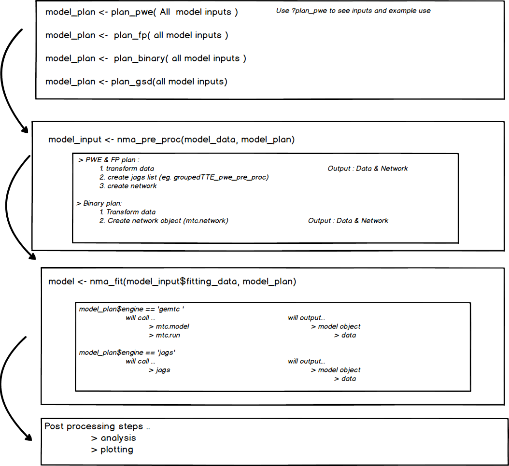

_Package under development (draft)._

## Introduction


This package was created to centralise some functions and reports which have
been in development by the ACE team at Roche. This has the benefit of allowing 
other users to more easily run the same analyses and also contribute to the suite
of functions that aid the workflow. In creating the package several processes
and standards were decided upon which aim to ensure that analysis is reproducible
and scalable.


## Installation

Installation is simple, either install directly from this repo [... give code ...], or download a source and install from the tarball `install.packages("gemtcPlus_1.0.0.tar.gz", repos = NULL, type = "source")`.

## Getting Started

There are some quick-start guides which are built into this package in vignettes. The guides cover the basics and any specific conventions regarding report writing, function building, unit testing. An easy way to see these guides (and example analysis reports) is by calling `browseVignettes(package = "gemtcPlus")` after the package has been installed. These examples can be used as templates.

Running the below will create a new skeleton template with the correct sections to fill. The type argument supplied will determine which planning function the document is pre-populated with. 


```
create_template("pwe") # fp, binary and gsd are also supported
```

Each plan_* function comes with a help file detailing the model input parameters to use, for example `?plan_pwe` to view the help on planning a piecewise exponential model. 

### Workflow
The below image is a schemeatic representation of the new workflow. The information boxes within each section give an idea of which functions are being called in the backend.


### 


